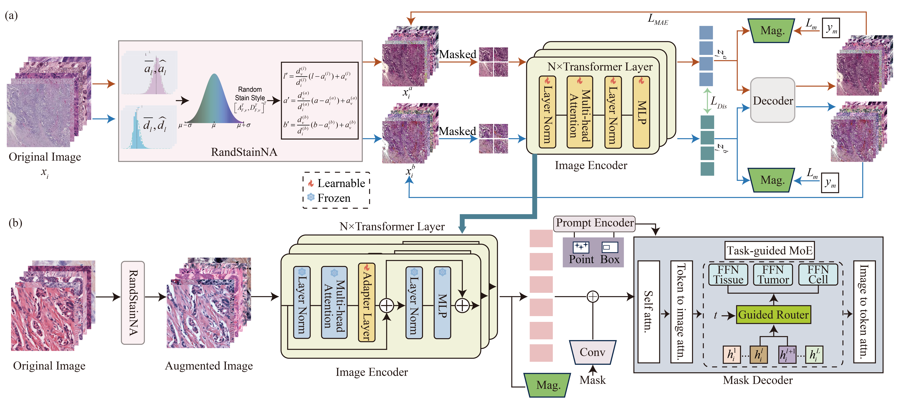

# SegAnyPath

Implementation for the paper: "SegAnyPath: A Foundation Model for Multi Resolution Stain-Style and Task Pathology Image Segmentation“



## Setup

### 1. Environment

```
pip install -r requirements.txt
```


## 2. Train
```
python train.py

```

## Acknowledgement

Thanks to the open-source of the following projects: [SAM-Med2d](https://github.com/OpenGVLab/SAM-Med2D), [Segment Anything](https://github.com/facebookresearch/segment-anything).


